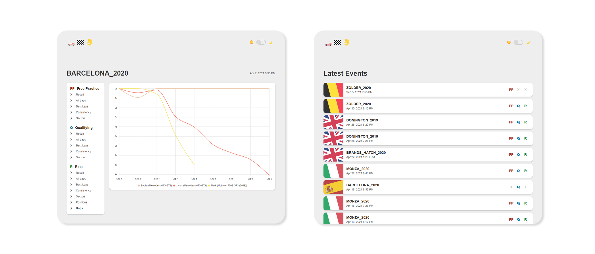

## ACC Viewer 🏎️🏁👌

**An Assetto Corsa Competizione results viewer powered by log files**



### Prerequisites

- ACC server with `dumpLeaderboards` enabled - [Docs](https://www.acc-wiki.info/wiki/Server_Configuration#Result_Files)
- Node 14 ⚠️

### Setup

1. Install the dependencies
    ```bash
    npm install
    ```
1. Build the application
    ```bash
    npm run build
    ```
1. Update the .env file
    ```
    PORT=9000
    RESULTS_PATH="./relative-path-to-acc-server-logs"
    WATCH_INTERVAL_SECONDS=5
    ```
1. Start the server
    ```bash
    npm run start
    ```
1. Open http://localhost:9000 in your browser
1. The server will automatically pick up any new files created by your ACC server and make the results available.